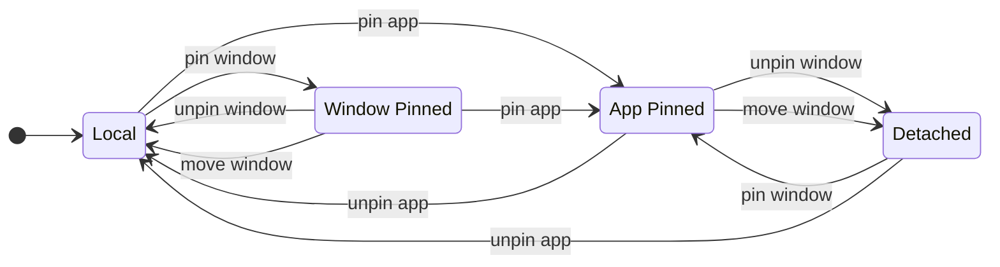

# move-win-vd

A minimal Windows utility that moves, pins, and unpins the active window across virtual desktops.

Fork/derivative of [ryomo/move-win-vd](https://github.com/ryomo/move-win-vd), extended with pin/unpin window and app actions.

## Requirements

- Windows 11 24H2 (26100.2605) or later

<br>

## Quick Start

### Download

Download `move-win-vd.exe` from the [Releases](https://github.com/Ilapides/move-win-vd/releases) page and place it anywhere you like, for example:

```text
C:\Tools\move-win-vd.exe
````

#### SmartScreen warning

Because this binary is not code-signed, Windows SmartScreen may block it from running. 

When launched via PowerToys Keyboard Manager, it can fail **silently** with no error message.

To unblock the file:

1. Right-click `move-win-vd.exe` → **Properties**.
2. At the bottom of the **General** tab, check **Unblock**.
3. Click **OK**.

### Recommended Setup: PowerToys Keyboard Manager

The most convenient way to use this tool is to bind it to keyboard shortcuts via [PowerToys Keyboard Manager](https://learn.microsoft.com/en-us/windows/powertoys/keyboard-manager).

1. Install [PowerToys](https://github.com/microsoft/PowerToys).
2. Open PowerToys and go to **Keyboard Manager** → **Remap a shortcut**.
3. Add the following shortcuts:

| Shortcut                          | Program           | Arguments | Effect                                     |
| --------------------------------- | ----------------- | --------- | ------------------------------------------ |
| `Win + Ctrl + Alt + Right`        | `move-win-vd.exe` | `r /s`    | Move window to next desktop and follow     |
| `Win + Ctrl + Alt + Left`         | `move-win-vd.exe` | `l /s`    | Move window to previous desktop and follow |
| `Win + Ctrl + Alt + Up`           | `move-win-vd.exe` | `p`       | Pin active window on all desktops          |
| `Win + Ctrl + Alt + Down`         | `move-win-vd.exe` | `u`       | Unpin active window                        |
| `Win + Ctrl + Alt + Shift + Up`   | `move-win-vd.exe` | `pa`      | Pin active app on all desktops             |
| `Win + Ctrl + Alt + Shift + Down` | `move-win-vd.exe` | `ua`      | Unpin active app                           |

**Tips:**

* Use the full path to `move-win-vd.exe` in the Keyboard Manager configuration, for example `C:\Tools\move-win-vd.exe`.
* Add `/w` if you want wrap-around behavior at the edges.
* If you only want to move the window without switching desktops yourself, omit `/s`.

<br>

## Command Line

```text
move-win-vd.exe r|l|p|u|pa|ua [/w] [/s]
```

### Arguments

| Argument | Description                                                     |
| -------- | --------------------------------------------------------------- |
| `r`      | Move the active window to the **next** virtual desktop          |
| `l`      | Move the active window to the **previous** virtual desktop      |
| `p`      | Pin the active window so it appears on **all** virtual desktops |
| `u`      | Unpin the active window                                         |
| `pa`     | Pin the active window's **app** on all virtual desktops         |
| `ua`     | Unpin the active window's **app**                               |

One action argument is required.

### Options

| Option | Description                                                                 |
| ------ | --------------------------------------------------------------------------- |
| `/w`   | **Wrap around** — if at the last desktop, move to the first, and vice versa |
| `/s`   | **Switch** — also move your view to the destination desktop                 |

`/w` and `/s` apply to `r` / `l` move actions only.

Pin/unpin actions are terminal: `p`, `u`, `pa`, and `ua` do not run move-desktop logic afterward.

### Examples

```powershell
# Move window to the next desktop
move-win-vd.exe r

# Move window to the previous desktop, wrapping around if at the edge
move-win-vd.exe l /w

# Move window to the next desktop and follow it there
move-win-vd.exe r /s

# Move window to the previous desktop, follow it, and wrap around
move-win-vd.exe l /s /w

# Pin the active window on all desktops
move-win-vd.exe p

# Unpin the active window
move-win-vd.exe u

# Pin/unpin the active app on all desktops
move-win-vd.exe pa
move-win-vd.exe ua
```

<br>

## Pin/Unpin Behavior

Pinning uses Windows virtual desktop APIs via `winvd`. Some behavior is therefore inherited from Windows itself rather than implemented directly by this tool.

Windows has two related but distinct kinds of virtual desktop pinning:

* **Pin window**: makes one specific window visible on every virtual desktop.
* **Pin app**: makes every window belonging to that app visible on every virtual desktop.

This creates four practical states:

| State             | Meaning                                                                |
| ----------------- | ---------------------------------------------------------------------- |
| **Local**         | The window is visible on one virtual desktop.                          |
| **Window Pinned** | This specific window is visible on all virtual desktops.               |
| **App Pinned**    | All windows belonging to the app are visible on all virtual desktops.  |
| **Detached**      | The app is pinned, but this specific window has been made local again. |



### Important quirks

| Action                                       | Result                                                                                                         |
| -------------------------------------------- | -------------------------------------------------------------------------------------------------------------- |
| Move a local window                          | The window moves to the target desktop and stays local.                                                        |
| Move a window-pinned window                  | The window becomes unpinned and appears only on the target desktop.                                            |
| Move a window belonging to an app-pinned app | That window becomes **detached**: the app remains pinned, but this window becomes local to the target desktop. |
| Unpin a window-pinned window                 | The window becomes local on the current desktop.                                                               |
| Unpin one window from an app-pinned app      | That window becomes **detached**; other app windows may remain app-pinned.                                     |
| Unpin the app                                | All windows of that app collect on the desktop where the app was unpinned.                                     |
| Open a new window while the app is pinned    | The new window inherits the app-level pin.                                                                     |

For predictable behavior:

* Use `p` / `u` when you want to control only the active window.
* Use `pa` / `ua` when you want to control the whole app.
* Remember that moving a pinned window is also an implicit unpin/detach operation.

<br>

## Troubleshooting

### Shortcuts not working with PowerToys FancyZones

If you have FancyZones enabled with **"Override Windows Snap"** turned on, your custom shortcuts may stop working — even if those key combinations are not used by FancyZones at all.

This appears to be a side effect of how FancyZones hooks into keyboard input globally when that option is enabled.

**Fix:** Disable **"Override Windows Snap"** in FancyZones settings, or reassign your shortcuts to key combinations that do not involve arrow keys.

<br>

## Development

### Building

```powershell
cargo build --release
```

The binary will be at:

```text
target/release/move-win-vd.exe
```

### Release Process

Below is the process for releasing a new version on GitHub.

1. Go to **Actions** → **release** → **Run workflow**, enter the version number, for example `1.2.3`, and run it.

   * This automatically updates `Cargo.toml` and `Cargo.lock`, commits the changes, and creates + pushes the `v*.*.*` tag.
   * Then, the app is built and a draft release is created.
2. Once the workflow completes, go to the GitHub releases page, find the draft release, review the content, and publish it.
3. Run `git pull` to update your local repository with the new tag.

<br>

## License

MIT
